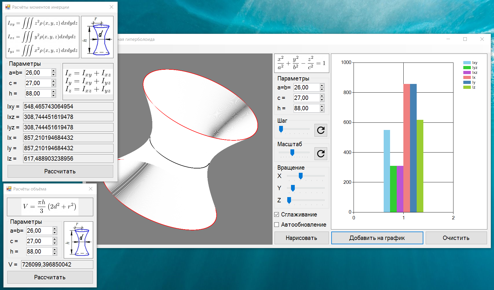

# Hyperboloid
A program for drawing a single-sheeted hyperboloid and automatically calculating its parameters (inertia and volume). Rendering has such settings as: step, scale, hyperboloid rotation, anti-aliasing, and automatic rendering when parameters are changed.

The calculations are described in [this](Однополостная%20гиперболоида%20-%20расчёты.docx) file. The program was developed in 1.5 days.

